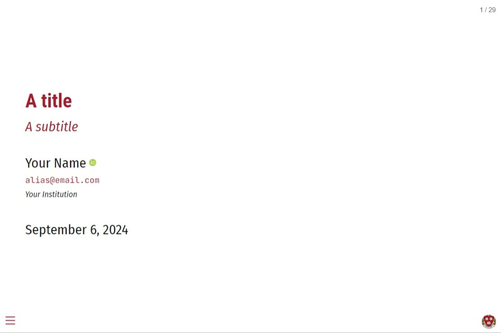

# Quarto Clean Theme

A minimalist and elegant presentation theme for Quarto Reveal.js, inspired by Kyle's
[LaTex template](https://raw.githack.com/kylebutts/templates/master/latex-slides/slides.pdf). This version of the repository has been updated to match the API 209 course palette. The original template is based on Grant McDermott's work, so all kudos to him and Kyle Butts.

Click the screenshot below to be taken to a
[live demo](https://rrmaximiliano.github.io/quarto-revealjs-clean-api/template.html#/title-slide).

[](https://rrmaximiliano.github.io/quarto-revealjs-clean-api/template.html#/title-slide)

## Use

Depending on your use case, here are some [Quarto CLI](https://quarto.org/)
commands to get started.

If you would like to add the **clean** api theme to an existing directory:

```bash
quarto install extension rrmaximiliano/quarto-revealjs-clean-api
```

Alternatively, you can use a
[Quarto template](https://quarto.org/docs/extensions/starter-templates.html)
that bundles the **clean** theme plus a .qmd starter document. This is a better
option if you are starting a new project from scratch, since it will automatically
create a new directory with all of the necessary scaffolding in one go. We provide
two template options.